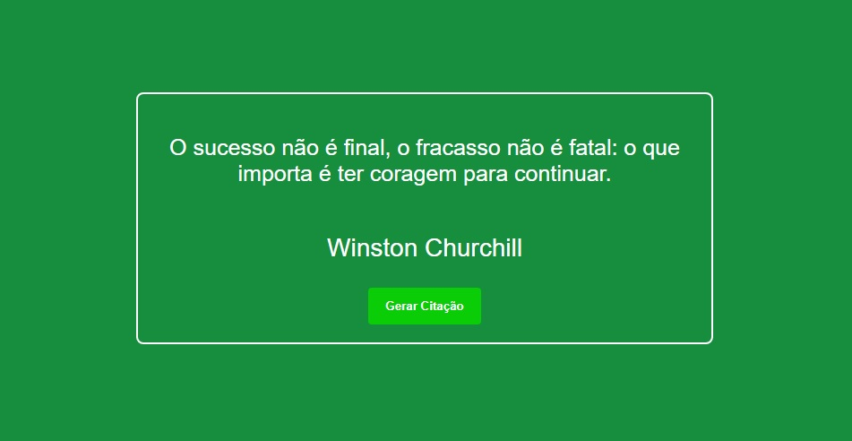

<h1 align="center"> Citações de frases interessantes </h1>

Citações de frases do curso de projetos de JavaScript  

  &nbsp;&nbsp;&nbsp;|&nbsp;&nbsp;&nbsp;<a href="#-tecnologias">Tecnologias</a>&nbsp;&nbsp;&nbsp;|&nbsp;&nbsp;&nbsp;  

 

  

## 🚀 Tecnologias

Esse projeto foi desenvolvido com as seguintes tecnologias:

- HTML 
- CSS
- JavaScript
- Git e Github
---

Feito por Renato de Paula  